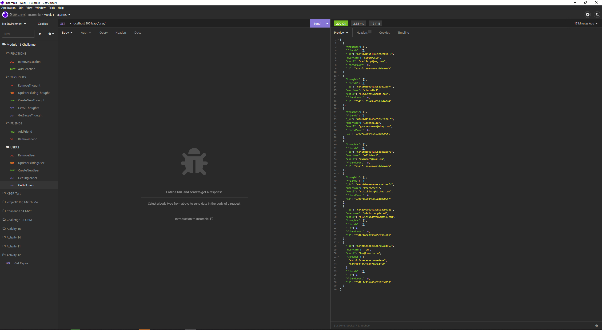
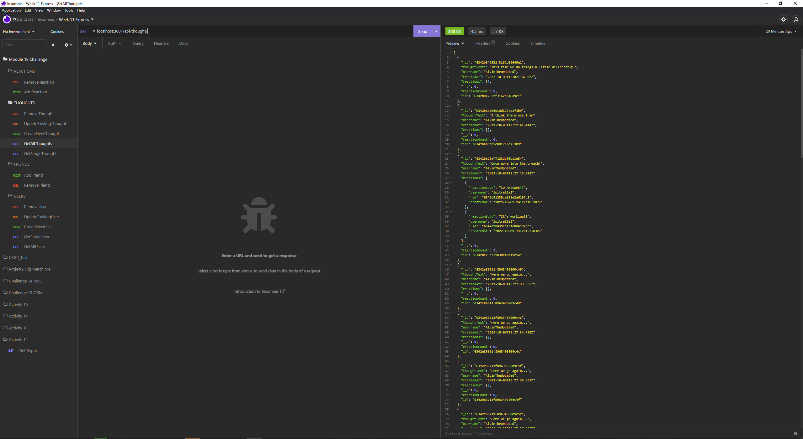

# Simple Social Network API

This was the Fourteenth challenge assignment for our UPENN Bootcamp. We were tasked with creating a Social Media API that would allow us to perform CRUD operations using MongoDB. (See **User Story** and **Acceptable Criteria** sections below).

---

## 📕 User Story

AS A social media startup I WANT an API for my social network that uses a NoSQL database SO THAT my website can handle large amounts of unstructured data

---

## ✔️ Acceptable Criteria

- GIVEN a social network API
- WHEN I enter the command to invoke the application THEN my server is started and the Mongoose models are synced to the MongoDB database
- WHEN I open API GET routes in Insomnia for users and thoughts THEN the data for each of these routes is displayed in a formatted JSON
- WHEN I test API POST, PUT, and DELETE routes in Insomnia THEN I am able to successfully create, update, and delete users and thoughts in my database
- WHEN I test API POST and DELETE routes in Insomnia THEN I am able to successfully create and delete reactions to thoughts and add and remove friends to a user’s friend list

---

## 🔧 Optimizations

- Uses MongoDB

### Javascript

- Allows user to perform CRUD operations for Users
- Allows user to perform CRUD operations for Thoughts
- Allows user to add / remove reactions to posts
- Allows user to add / remove friends

---

## 📷 Screenshots

---

## 🎯 Deployment

Repository: https://github.com/alvinkp/SimpleSocialNetworkAPI

Walkthrough Video: https://drive.google.com/file/d/1zQ65xxeYoESxJ_YaB7A2aRclkpoulDEY/view

---

## ✉️ Authors

- [@alvinkp](https://www.github.com/alvinkp)
